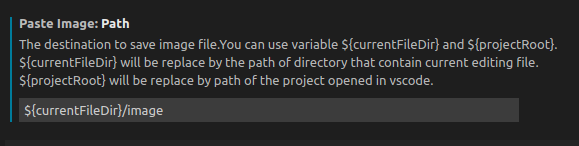
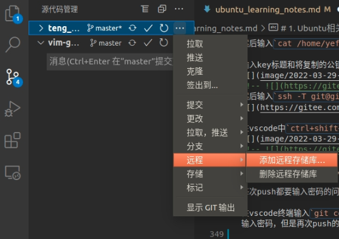

<div align='center'>
  <br /><br />
  <strong><font size = 10>Ubuntu学习笔记</font></strong>
  <br /><br /><br /><br />
</div>

<!-- TOC -->

- [1. Ubuntu相关问题及解决方案](#1-ubuntu相关问题及解决方案)
  - [1.1 Ubuntu联网问题](#11-ubuntu联网问题)
    - [1.1.1 Ubuntu(16.04)显示已经连接有线网络但是不能上网](#111-ubuntu1604显示已经连接有线网络但是不能上网)
    - [1.1.2 Ubuntu连接家里的网](#112-ubuntu连接家里的网)
  - [1.2 搜狗输入法繁体字](#12-搜狗输入法繁体字)
  - [1.3 Ubuntu和win10时间不同步](#13-ubuntu和win10时间不同步)
  - [1.4 Vscode相关设置问题](#14-vscode相关设置问题)
    - [1.4.1 Vscode自己定义带时间的自定义快捷注释](#141-vscode自己定义带时间的自定义快捷注释)
    - [1.4.2 Vscode关闭源代码管理](#142-vscode关闭源代码管理)
    - [1.4.2 Vscode自动格式化](#142-vscode自动格式化)
    - [1.4.3 Vscode配置Markdown](#143-vscode配置markdown)
    - [1.4.4 Vscode g++ c++-11编译cpp文件](#144-vscode-g-c-11编译cpp文件)
    - [1.4.5 Vscode配置git同步gitee](#145-vscode配置git同步gitee)
    - [1.4.6　Ubuntu + picgo 配置gitee图床](#146ubuntu--picgo-配置gitee图床)
  - [1.5 Ubuntu下安装微信](#15-ubuntu下安装微信)
  - [1.6 Ubuntu下安装Firefox](#16-ubuntu下安装firefox)
  - [1.7 Ubuntu下安装Typora](#17-ubuntu下安装typora)
  - [1.8 Ubuntu18.04安装独显驱动](#18-ubuntu1804安装独显驱动)
  - [1.9 记录ROG 幻14 装Ubuntu18.04](#19-记录rog-幻14-装ubuntu1804)
  - [1.10 Ubuntu18.04更新内核(手动安装)/卸载清除旧版本内核](#110-ubuntu1804更新内核手动安装卸载清除旧版本内核)
    - [1.10.1 更新内核(手动安装)](#1101-更新内核手动安装)
    - [1.10.2 清除卸载旧版本内核](#1102-清除卸载旧版本内核)
  - [1.11 ubuntu18.04安装](#111-ubuntu1804安装)
  - [1.11.1 Ubuntu分区方案](#1111-ubuntu分区方案)
- [2. 学习整理](#2-学习整理)
  - [2.1 SLAM](#21-slam)
    - [2.1.1 半稠密SLAM:EAO-SLAM](#211-半稠密slameao-slam)
  - [2.2 代码学习](#22-代码学习)
    - [2.2.1 string::find()](#221-stringfind)
    - [2.2.2 超出 INT_MAX 和 INT_MIN](#222-超出-int_max-和-int_min)
    - [2.2.3 函数数组以「引用」方式传递 (int &x)](#223-函数数组以引用方式传递-int-x)
    - [2.2.4 stoi()函数：string->十进制int](#224-stoi函数string-十进制int)
    - [2.2.5 C++ 优先级队列 priority_queue(STL priority_queue)](#225-c-优先级队列-priority_queuestl-priority_queue)
    - [2.2.6 对于map[]的使用问题](#226-对于map的使用问题)
    - [2.2.7 有关Vector<int>初始化的问题](#227-有关vectorint初始化的问题)
    - [2.2.8 前缀和](#228-前缀和)
    - [2.2.9 起泡法排序](#229-起泡法排序)
    - [2.2.10 单调栈，这个题属实是没学的话想不到这么做](#2210-单调栈这个题属实是没学的话想不到这么做)
    - [2.2.11 链表排序](#2211-链表排序)
    - [2.2.12 low_bound()](#2212-low_bound)
    - [2.2.13 204. 计数质数](#2213-204-计数质数)
    - [2.2.14 vector size()函数要注意的问题](#2214-vector-size函数要注意的问题)
    - [2.2.15 判断char型变量是否为字符数字等](#2215-判断char型变量是否为字符数字等)
    - [2.2.16 sort函数将vector数组按照元素绝对值从小到大排序](#2216-sort函数将vector数组按照元素绝对值从小到大排序)
    - [2.2.17 vector::reserve()函数](#2217-vectorreserve函数)
    - [2.2.17 二叉树搜索整个数(要返回值)/二叉树搜索一条边(不要返回值)](#2217-二叉树搜索整个数要返回值二叉树搜索一条边不要返回值)
    - [2.2.18 有关自定义题目输入的内容必须要好好看看，这是LeetCode所没有的](#2218-有关自定义题目输入的内容必须要好好看看这是leetcode所没有的)
    - [2.2.19 二叉树深度优先搜索(DFS)、广度优先搜索(BFS)](#2219-二叉树深度优先搜索dfs广度优先搜索bfs)
    - [2.2.20  二叉树的序列化与反序列化](#2220--二叉树的序列化与反序列化)
    - [2.2.21 substr函数](#2221-substr函数)
  - [2.3 刷题记录](#23-刷题记录)
    - [2.3.1 还没做的：](#231-还没做的)
    - [2.3.2 其它](#232-其它)
- [3. 学习问题及解决方案](#3-学习问题及解决方案)
  - [3.1 Ubuntu16.04+python27安装jupyter notebook后,](#31-ubuntu1604python27安装jupyter-notebook后)
  - [3.2 ROS](#32-ros)
    - [3.2.1 安装ROS](#321-安装ros)
    - [3.2.2 从rosbag中提取图片](#322-从rosbag中提取图片)
    - [3.3.3 ORB-SLAM2 ROS编译](#333-orb-slam2-ros编译)
  - [3.3 Ubuntu安装boost](#33-ubuntu安装boost)
  - [3.4 Ubuntu16.04配置ROS工作空间](#34-ubuntu1604配置ros工作空间)
  - [3.5](#35)
  - [3.6 OpenCV相关问题](#36-opencv相关问题)
    - [3.6.1 安装OpenCV](#361-安装opencv)
    - [3.6.2 卸载OpenCV](#362-卸载opencv)
    - [3.6.3 libopencv_core.so.2.4: cannot open shared object file: No such file or directory](#363-libopencv_coreso24-cannot-open-shared-object-file-no-such-file-or-directory)
  - [3.7 GCC/G++](#37-gccg)
    - [3.7.1 多版本gcc/g++优先级](#371-多版本gccg优先级)
    - [3.7.2 Ubuntu16.04安装gcc7/g++7](#372-ubuntu1604安装gcc7g7)
  - [3.8 Eigen](#38-eigen)
    - [3.8.1 查看Eigen3版本](#381-查看eigen3版本)
  - [3.9 g2o](#39-g2o)
    - [3.9.1 卸载g2o](#391-卸载g2o)
  - [3.10 vim相关](#310-vim相关)
    - [3.10.1 vim，vi经常卡死（其实并不是它卡了）](#3101-vimvi经常卡死其实并不是它卡了)
    - [3.10.2 vim复制文字到外面](#3102-vim复制文字到外面)
- [4. 数据结构](#4-数据结构)
  - [数组](#数组)
  - [链表](#链表)
    - [链表基本概念](#链表基本概念)

<!-- /TOC -->


# 1. Ubuntu相关问题及解决方案

## 1.1 Ubuntu联网问题

### 1.1.1 Ubuntu(16.04)显示已经连接有线网络但是不能上网

（Ubuntu16.04）显示已经连接了有线网络但是不能上网，设置里看到的连接状态没有问题。

解决方案：

sudo gedit /etc/resolv.conf 
将`nameserver 127.0.1.1`
改为

`nameserver 8.8.8.8`
`nameserver 8.8.4.4`


### 1.1.2 Ubuntu连接家里的网

关于Ubuntu连接家里的网: 

用荣耀的路由器，有线无线打开网页都很慢，但是手机使用正常，Windows应该也正常；<br>
用TP-Link路由器，连接无线打开网页挺快，连接有线网络时要把无线网络断开（！），否则很慢，不知道为啥。


## 1.2 搜狗输入法繁体字

按住shift 不放，同时，按下ctrl 和F键，即可。


## 1.3 Ubuntu和win10时间不同步

Ubuntu16.04和windows时间不同步

参考https://blog.csdn.net/DragonGirI/article/details/90167053

## 1.4 Vscode相关设置问题

### 1.4.1 Vscode自己定义带时间的自定义快捷注释

Vscode自己定义带时间的自定义快捷注释：
1.ctrl+shift+p打开设置
2.输入>snippets,进入
首选项：Preferences: Configures User Snippets
3.根据需要点击cpp.json(c++)
4.自定义输入内容，如：

```json
	"Print to console": {
			"prefix": "tengh_edit",
			"body": [
				"//----------------",
				"//--Description: ",
				"//--Edit by TengHao",
				"//--Date: ${CURRENT_YEAR}-${CURRENT_MONTH}-${CURRENT_DATE} ${CURRENT_HOUR}:${CURRENT_MINUTE}:${CURRENT_SECOND}",
				"$0",
			],
			"description": "Log output to console"
		}
```

### 1.4.2 Vscode关闭源代码管理

Vscode关闭源代码管理:

(开启的话，资源管理器中的文件列表中的文件名后面会显示字母和数字)
文件-首选项-设置
搜索Git:enable
取消勾选 
>Git:enable
>□是否启用Git

### 1.4.2 Vscode自动格式化

Editor: Format on type
□控制编辑器在键入一行之后是否自动格式化该行。

### 1.4.3 Vscode配置Markdown

+ Vscode 安装插件Mardown TOC (设置Markdown自动目录)
	
	在设置中搜索Eol，将"File: Eol 默认行尾字符" 的 "auto" 改为 "\n"
	右键-Markdown TOC: Insert/update 即可插入目录 (Markdown Sections: Insert/update 是自动编号)

+ Vscode 安装插件 Markown All in One (necessary)
+ Vscode 安装插件 Markown Preview Enhanced 
	安装之后预览窗口变成白底
	Ctrl + k 松开后再按v，即可在侧边打开预览窗后。或者直接Ctrl + shift + v 在当前位置打开预览窗口。 或者鼠标点击右上角的打开侧边栏小按钮。
  + Vscode更改 Markown Preview Enhanced中的字体大小等：
	`Ctrl + shift + p` - 输入 `Customize Css`
	
	打开，在style.less中修改`font-size: 14px`的数值即可调节（没有这句话，就添加上）
	
+ Vscode 安装插件 Markdown Preview Github Styling
+ Vscode安装插件Paste Image （用于粘贴剪贴板中的图片）
	安装完成后右键扩展-扩展设置
	更改以下两个设置
	
	
		
	```shell
	#安装xclip, 以便能粘贴Ubuntu自带剪切软件screen截图的剪切板内容	
	sudo apt-get install xclip 
	```
	截图到剪切板后按```Ctrl + alt + v``` 粘贴


### 1.4.4 Vscode g++ c++-11编译cpp文件

__编译__ : 点击左侧的 `run and debug` - 选择 `create a launch.json file` -选择`GDB`编译 -随便选择一个版本的g++，即可

生成 **launch.json** 和 **tasks.json** 文件, 内容如下。

```json
{
    // launch.json文件
    "version": "0.2.0",
    "configurations": [
        {
            "name": "g++ - 生成和调试活动文件",
            "type": "cppdbg",
            "request": "launch",
            "program": "${fileDirname}/${fileBasenameNoExtension}",
            "args": [],
            "stopAtEntry": false,
            "cwd": "${fileDirname}",
            "environment": [],
            "externalConsole": false,
            "MIMode": "gdb",
            "setupCommands": [
                {
                    "description": "为 gdb 启用整齐打印",
                    "text": "-enable-pretty-printing",
                    "ignoreFailures": true
                },
                {
                    "description": "将反汇编风格设置为 Intel",
                    "text": "-gdb-set disassembly-flavor intel",
                    "ignoreFailures": true
                }
            ],
            "preLaunchTask": "C/C++: g++ 生成活动文件",
            "miDebuggerPath": "/usr/bin/gdb"
        }
    ]
}
```


```json

//task.json
{
    "tasks": [
        {
            "type": "cppbuild",
            "label": "C/C++: g++ 生成活动文件",
            "command": "/usr/bin/g++",
            "args": [
                "-fdiagnostics-color=always",
                "-g",
                "${file}",
				//"-std=c++11",
                "-o",
                "${fileDirname}/${fileBasenameNoExtension}"
            ],
            "options": {
                "cwd": "${fileDirname}"
            },
            "problemMatcher": [
                "$gcc"
            ],
            "group": {
                "kind": "build",
                "isDefault": true
            },
            "detail": "调试器生成的任务。"
        }
    ],
    "version": "2.0.0"
}

```
|||
|-|-|
|Run Code|`Ctrl + alt + N`|
|Run build Task|`Ctrl + shift + B`|
|debug|`F5`|


网上都说要在task.json中的`"args"`加入`"-std=c++11",`，但是我没加，只是加了下一步，也可以编译`c++-11`的语法.

在扩展中搜索**code runner**, 右键 - Extension Setting
在`Code-runner: Executor Map`

添加以下代码：
```json
    //Tenghao teng add:
    "C_Cpp.default.cppStandard": "c++11",
    "code-runner.executorMap": {
        
        "cpp": "cd $dir && g++ $fileName -o $fileNameWithoutExt -std=c++11 -lpthread && $dir$fileNameWithoutExt"
    }
```
完成上述步骤即使用c++-11的标准进行调试编译


> 好像跟下面的方法无关，重启了一下vscode就没有波浪线了
**但是在编辑器中，还是会用有波浪线提示不符合gnu98语法规则**，还要进行如下操作：
`Ctrl + shift + p` - `C/C++ : Edit Configurations(UI)` 
在其中添加或修改为 `"cppStandard": "gnu++11",`


over!


### 1.4.5 Vscode配置git同步gitee

参考的这个csdn博客
[VsCode使用Git连接Gitee和GitHub](https://blog.csdn.net/qq_38981614/article/details/115013188?spm=1001.2101.3001.6650.2&utm_medium=distribute.pc_relevant.none-task-blog-2%7Edefault%7ECTRLIST%7ERate-2.pc_relevant_antiscanv2&depth_1-utm_source=distribute.pc_relevant.none-task-blog-2%7Edefault%7ECTRLIST%7ERate-2.pc_relevant_antiscanv2&utm_relevant_index=5)


新建gitee仓库，这个不过多描述了

在终端运行新建仓库中复制过来的如下代码：
```shell
git config --global user.name "xxxxxx"
git config --global user.email "xxxxxxxxxxx@user.noreply.gitee.com"
```

<!--  --;>


然后在终端运行：
`ssh-keygen -t rsa -C "10678859+tengtengh@user.noreply.gitee.com"`
(这里的冒号中的邮箱是和上一步的邮箱一样的)
后续有确认的内容全都是直接回车（按照网上的说法就是三下回车）输出如下

<!--  -->

然后输入`cat /home/yefei/.ssh/id_rsa.pub`将输出的内容(公钥，ssh-rsa...gitee.com)复制到

输入key标题和将复制的公钥粘贴到公钥文本框中，点击确定。

<!--  -->
然后输入`ssh -T git@gitee.com`查看结果


在vscode中`ctrl+shift+p`搜索`Git`选择git clone

<!--  -->
输入url（就是类似于 git clone **** 复制的那个），然后选择一个位置保存，用csdn打开
然后更改，点提交，选总是，提交的message内容随便写，再点推送(push),或者是同步，左下角

每次push都要输入密码的问题。解决方案：

在vscode终端输入`git config --global credential.helper store`,重启之后，再push（或者同步）的时候要输入密码，但是再次push的时候则不需要密码了。


其它的:
 还有一个在bilibili看的一个[VSCode提交代码到gitee码云](https://www.bilibili.com/video/BV18Z4y1P73M?spm_id_from=333.337.search-card.all.click)
是在远程存储库里面添加


### 1.4.6　Ubuntu + picgo 配置gitee图床
在这里我主要参考的[这篇csdn博客](https://blog.csdn.net/xiaodingzi127/article/details/112248081?utm_medium=distribute.pc_relevant.none-task-blog-2~default~baidujs_utm_term~default-1.topblog&spm=1001.2101.3001.4242.2&utm_relevant_index=4)


首先在gitee上新建一个个人仓库，名称我起的是images，然后勾上使用readme文件初始化这个仓库那个选项，选择分支模型-这里我选择的是单分支模型，点击创建

然后点那个初始话readme文件0，然后在管理中将仓库设置为公开


首先下载picgo，https://github.com/Molunerfinn/PicGo/releases 
我在这里下载的是PicGo-2.3.0.AppImage，如果你没有梯子网速不够、下载比较慢的话，这里给出我的csdn下载链接：https://download.csdn.net/download/weixin_46416035/85053549


下载后，右键属性，选择权限-勾选允许作为执行程序
双击打开-右键打开详细窗口即可。

在插件中搜索gitee，会出现几个选项，我下载的是gitee-uploader-1.1.2，建议你和我下载同一个版本，否则可能后续一些配置上不一样。
在这里它会提示你安装nodejs
这里我直接在终端通过sudo apt-get install notejs是不行的，可执行如下代码，然后重启picgo即可：
```shell
cd ~
curl -sL https://deb.nodesource.com/setup_14.x -o nodesource_setup.sh
sudo bash nodesource_setup.sh
sudo apt install nodejs
```
我在Ubuntu16.04上是OK的，看了一个博主在Ubuntu20.04上这样也是ok的，我相信你也一定可以 d e

安装好之后进行gitee设置

这里只需要填写前三个即可，repo就是你的"账户名/仓库名"，这里注意格式

branch就填写master即可，

然后在gitee的个人设置中新建私人令牌，私人名牌的描述就其名为image等，随意，将生成的私人令牌复制到token当中即可。


然后在PicGo设置中选择快捷键设置，即可自定义设置上传的快捷键，可以将剪切板的图片直接上传到gitee中，建议勾选PicGo设置中的时间戳重命名（可以防止上传的图片由于名称冲突导致的无法上传的问题）和上传后自动复制URL（每次上传之后，你就可以在markdown中直接粘贴类似与图片了）。

如果你不会怎么在Ubuntu系统下不借助任何第三方工具复制选区截图到剪切板的话，你可以看下面：
在Ubuntu的设置-键盘-快捷键-截图中，将复制选区到剪切板的快捷键自定义，即可实现选区截图（默认的快捷键是`ctrl+shift+PriSc`）

## 1.5 Ubuntu下安装微信

https://www.linuxprobe.com/how-Ubuntu-wechat.html

## 1.6 Ubuntu下安装Firefox

Ubuntu下安装Firefox（两种方式，建议方式2）

Ubuntu下安装Firefox（两种方式，建议方式2）
方式1：官网下载.tar.bz2压缩包离线安装
直接从http://www.firefox.com.cn/download/  上面下载Firefox-latest-x86_64.tar.bz2 
通过命令  tar -jxvf Firefox-latest-x86_64.tar.bz2 解压即可使用
要是想添加桌面快捷方式：
cd /usr/share/applications
sudo gedt firefox.desktop

将以下内容写入firefox.desktop文件

```
[Desktop Entry]
Name=Firefox
Comment=Firefox
Exec=/home/yefei/Atengh/app_and_lib/Firefox/firefox/firefox-bin
Icon=/home/yefei/Atengh/app_and_lib/Firefox/firefox/browser/chrome/icons/default/default128.png
Terminal=false
Type=Application
Categories=Browser;
```

参考《Ubuntu 16.04.3 LTS重新安装Firefox浏览器 》http://blog.sina.com.cn/s/blog_90b6c3080102wznl.html

方式2：
终端输入：

```shell
dpkg --get-selections |grep firefox
```

显示以下四个

```shell
firefox						install
firefox-locale-en				install
firefox-locale-zh-hans				install
unity-scope-firefoxbookmarks			install
```

然后安装这四个：

```shell
sudo apt-get install firefox firefox-locale-en firefox-locale-zh-hans unity-scope-firefoxbookmarks
```

------

## 1.7 Ubuntu下安装Typora

https://typora.io/releases/all

直接下载1.0.3版本 linux(64bit)deb

```shell
sudo dpkg -i xxxxxx.deb
```
## 1.8 Ubuntu18.04安装独显驱动
 <span id = "anchor">Ubuntu18.04安装独显驱动</span>

1、禁用nouveau

运行以下命令查看，如果有输出，则按照接下来的步骤禁用nouveau
```shell
lsmod | grep nouveau
```


创建下面文件：
```shell
sudo vim /etc/modprobe.d/blacklist.conf

``` 


在blacklist.conf文件内末尾插入以下内容(加入黑名单)：
```
blacklist nouveau
options nouveau modeset=0
```
1.blacklist nouveau 2. options nouveau modeset=0

执行以下命令使禁用生效并且**重启**：


```shell
sudo update-initramfs -u
```

```shell
reboot
```

重启之后运行以下命令查看，如果没有输出则说明禁用成功
```shell
lsmod | grep nouveau
```


2、apt-get安装显卡驱动

```shell
sudo add-apt-repository ppa:graphics-drivers/ppa
sudo apt-get update
```


输入以下指令查看建议的版本（应该是跟软件和更新-附加驱动里面的一样）
```shell
ubuntu-drivers devices
```

安装建议的版本, 例如：
（其实应该在软件和更新-附加驱动 中安装应该是一样的）

```shell
sudo apt-get install nvidia-driver-470
```

**安装好之后重启**


重启之后终端输入
```shell
nvidia-smi
```

或者(每隔2s刷新一次)
```shell
watch -n 2 nvidia-smi
```
安装完成


## 1.9 记录ROG 幻14 装Ubuntu18.04

i7 11代cpu RTX3060的显卡

电脑是2560×1660的屏幕，只能安装ubuntu18.04.6，要不分辨率是800×500(不过现在想想，搞好之后或许也能调2560×1660)

装好之后遇到的问题：
1. 屏幕亮度不能调节
2. 系统设置-显示 中的内置显示屏，名字是未知的显示器，不能调节分辨率，并且不能外接屏幕（无法识别）
3.  无WiFi适配器（原因：联发科7921网卡没有linux驱动。 解决方法：1、买一个usb网卡；2、换intel内置网卡）

在网上找到的解决问题2的方法是安装NVIDIA的独显驱动[1.8 Ubuntu18.04安装独显驱动](#18-ubuntu1804安装独显驱动)，但是安装之后开机黑屏：
引导项选择ubuntu之后无法进入系统，
屏幕上显示一行或几行字，最后一行是clear..file...block 卡住

网上的解决方案有以下几种（**都不行**）：

方法1：
 在引导界面的ubuntu上按e，在`quiet splash `后面加上 `nomodeset`, 按esc回到引导界面；（一次性方法，即每次开机都要这样，否则按照方法2改）

方法2：
 (同方法1，意思是方法1是一次性，这个是永久性的)
 引导界面选择Advanced options for Ubuntu，选择一个“recovery model”进入，选root 
 在此界面中 `sudo vim /etc/default/grub` 按 i 进入编辑模式

```
GRUB_CMDLINE_LINUX_DEFAULT="quiet splash"
# 修改为：
GRUB_CMDLINE_LINUX_DEFAULT="quiet splash nomodeset"
```
按esc 输入:wq！退出，reboot重启


方法3：
禁用nouveau， 但是在安装驱动之前已经禁用了，并没有什么用

方法4：
在拯救者电脑中，将显卡的混合模式改成独显直连，但是这个电脑没有独显直连

方法5（指标不治本，删除驱动）：
同方法2 进入root：

```shell
sudo apt-get remove --purge nvidia*
```

但是如果安装NVIDIA驱动的时候用的是.run手动安装，则没有办法了，就算是 uninstall之后也无法进入系统。


百思不得其解ing...

直到我看到了这个博客 https://blog.csdn.net/Kamfai_Row/article/details/120186348?spm=1001.2014.3001.5506 我才意识到要更新内核


查看本机内核
```shell 
uname -r
```
是5.4.0

于是按照链接中的建议更新5.6.0, 不能开机
又试了5.7.0和5.8.0 都不行，
5.9.0可以，不过开机有点慢，在引导项之后的黑屏文字界面会停留一会儿，于是又装了5.11.0，开机明显快了

装好之后屏幕亮度可以调节了，屏幕分辨率也可以调节了，设置-显示中也从“未知显示屏”变成了“内置显示屏”，外接显示屏也可以显示了，显卡驱动装了之后也不会开机卡住了


## 1.10 Ubuntu18.04更新内核(手动安装)/卸载清除旧版本内核


### 1.10.1 更新内核(手动安装)


以从5.4.0 - 5.11.0为例
查看本机内核
```shell 
uname -r
```
是5.4.0

下载所要用到的包 https://kernel.ubuntu.com/~kernel-ppa/mainline/ 


下载第1、3、4、6个(右键复制链接 wget下载)

```shell
##1个all和3个generic
wget https://kernel.ubuntu.com/~kernel-ppa/mainline/v5.11/amd64/linux-headers-5.11.0-051100_5.11.0-051100.202102142330_all.deb
wget https://kernel.ubuntu.com/~kernel-ppa/mainline/v5.11/amd64/linux-headers-5.11.0-051100-generic_5.11.0-051100.202102142330_amd64.deb
wget https://kernel.ubuntu.com/~kernel-ppa/mainline/v5.11/amd64/linux-image-unsigned-5.11.0-051100-generic_5.11.0-051100.202102142330_amd64.deb
wget https://kernel.ubuntu.com/~kernel-ppa/mainline/v5.11/amd64/linux-modules-5.11.0-051100-generic_5.11.0-051100.202102142330_amd64.deb
```
```json
sudo dpkg -i *.deb
```
如果一个一个编译的话，它们互相依赖，容易安装不上

如果不小心搞错了，报错依赖问题，就`sudo apt-get install -f`来修复问题

重启，即可

再次启动的时候在引导界面选择Advanced options for Ubuntu，可以看到新安装的内核在第一个

### 1.10.2 清除卸载旧版本内核

**针对的是上一步通过`dpkg`命令安装的内核**
以删除5.13.0为例

```shell
#查看已经安装的内核
dpkg --get-selections | grep linux
```


要删除以下几个
```shell
linux-headers-5.13.0-051300			install
linux-headers-5.13.0-051300-generic		install
linux-image-unsigned-5.13.0-051300-generic	install
linux-modules-5.13.0-051300-generic		install
```

根据上的方法是 `sudo apt-get remove ***` 这几个，不过这样删除之后再次运行`dpkg --get-selections | grep linux`结果如下


于是我建议，如果是自己手动安装的内核，可以直接用命令`sudo dpkg --purge **`来卸载

卸载后再次查看`dpkg --get-selections | grep linux`,
并输入`sudo update-grub`更新启动项(根据情况选择grub/grub2)

## 1.11 ubuntu18.04安装

## 1.11.1 Ubuntu分区方案


*也未必一定要这样，不过我这样是没错

|||||
|-|-|-|-|
|根目录 / | 主分区 | ext4 | 100G| 
|swap | 逻辑分区 | swap area |16G |
| /boot|  逻辑分区 | ext4 | 2G|的那个目录是不能选的)|
| /home | 逻辑分区 | ext4 |100G|

\*swap分区 ( 好像可以不要？网上有的说是运行内存的两倍 )
\*/boot分区 ( 不要放在根目录下面，安装时，安装界面的最下面的下拉菜单选这个分区，根目录下面 )

2022-04-09 给刘亚飞师兄的电脑安装ubuntu18.04的时候

分配好/boot,swap,/,/home这几个区的大小，点击安装时这个错误：No EFI system partition was found, the system will likely not be able to boot successfully and the installation may fail

制作启动盘的时候，选择MBR，bios中不选择UEFI启动项选另一个

# 2. 学习整理

## 2.1 SLAM

### 2.1.1 半稠密SLAM:EAO-SLAM

https://github.com/yanmin-wu/EAO-SLAM 

半稠密SLAM但是不完整，只能用一个tum fr3_long_office_house

## 2.2 代码学习

### 2.2.1 string::find()

```c++
string::find()
std::string s("123456789abcde"); 
std::string::size_type postion;
//1.
//find函数返回ab在s中的位置
postion = s.find("ab");
//2.
//find函数，从字符串s下标5开始，查找"ab"并返回ab在s中的位置
postion = s.find("ab"，5);
//如果没有找到ab，则postion==std::string::npos
```

### 2.2.2 超出 INT_MAX 和 INT_MIN

int型变量的最大值、最小值分别为 


``` c++
INT_MAX = 2147483647
INT_MIN = -2147483648
```

对于g++-5来说（因为我在Ubuntu上用的是这个）,当``int a = INT_MAX +　１``的时候, ``a``会被赋值为``INT_MIN``, 当``int a = INT_MAX +　2``的时候, ``a``会被赋值为``INT_MIN + 1``, 以此类推，即构成一个封闭的，类似"环状的结构", 当a小于`INT_MIN``的时候也是如此。

但要注意的一点是, 在一些LeetCode上规定int范围的题目中，这样的取值，往往是会报错的！！！！！！

### 2.2.3 函数数组以「引用」方式传递 (int &x)

如果函数的参数对象是以“引用”方式传递的。也就是说，不对实参作任何拷贝，那么在函数内部对于该参数的改变，也同时会在函数外的主程序内引起函数的改变，例子如下。
```c++
int fun(int &x){
	x = x * x;
	return 0;
}
int main(){
	int m = 2;
	int n = fun(m);
	cout << "m = " << m << endl;
}
//此时输出的此时输出的结果将为 m = 4;
```

### 2.2.4 stoi()函数：string->十进制int
stoi()函数：将n 进制的字符串转化为十进制int
```c++
string s("123");
int a = stoi(s);
cout << a <<　endl;
//output: 123
```

### 2.2.5 C++ 优先级队列 priority_queue(STL priority_queue)
http://c.biancheng.net/view/480.html
emplace和push的区别
```c++
//以下两种都可以
pri_que.emplace(data(1, 2));
pri_que.push(data(1, 2));

//还可以这样
pri_que.emplace(1, 2);
```
`pri_que.emplace("nine");`优于`pri_que.push("nine");`

### 2.2.6 对于map[]的使用问题
```c++
// 如下代码：
    unordered_map<string, int> umap;
    cout << umap["bb"] << endl;
    printMap<unordered_map<string, int>>(umap);//自己定义的函数
    cout << umap.empty() << endl;
```
output:
>0
key = bb value = 0
0


总结：调用umap["bb"]，会自己创建一个，value为0；

### 2.2.7 有关Vector<int>初始化的问题

```c++
vector<int> v(3);
printVector<int>(v)
```
output:
>[ 0 0 0 ]

```c++
vector<vector<int>> v;
v.size(3, vector<int>(2))
printVector<int>(v)
```
output:
>[ 0 0 ]
 [ 0 0 ] 
 [ 0 0 ]
### 2.2.8 前缀和
具体可以参考这个题 [304. 二维区域和检索 - 矩阵不可变](https://leetcode-cn.com/problems/range-sum-query-2d-immutable/)

之前没学过这个，很easy，但是没往这方面想，导致代码超时

### 2.2.9 起泡法排序
```c++
//起泡法排序
void bubble_sort(int A[], int n){
    for(bool sorted = false; sorted = !sorted; n--)
        for(int i = 1; i < n; i++){
            if(A[i - 1] > A[i]){
                swap(A[i - 1], A[i]);
                sorted = false;
            }
    }
}

```

### 2.2.10 单调栈，这个题属实是没学的话想不到这么做

[84. 柱状图中最大的矩形](https://leetcode-cn.com/problems/largest-rectangle-in-histogram/submissions/)
讲解是参考的： https://leetcode-cn.com/problems/largest-rectangle-in-histogram/solution/84-by-ikaruga/
官方的讲解颇为复杂

### 2.2.11 链表排序
[147.对链表进行插入排序](https://leetcode-cn.com/problems/insertion-sort-list/) 这个题的方法感觉很经典，比较通用可以说是，起泡法链表版？


### 2.2.12 low_bound()
该函数的作用为：找最接近的大于它的数

第一次见到这个函数，是在这里：
[220. 存在重复元素 III(https://leetcode-cn.com/problems/contains-duplicate-iii/submissions/)

这里主要是用在了
```c++
set<int> st;
st.insert(1);
st.insert(2);
st.insert(8);
st.insert(10);
auto it = st.low_bound(9);
cout << *it << endl;
```
输出为：10

更多详细的解析，见：http://m.biancheng.net/view/7521.html


### 2.2.13 204. 计数质数
https://leetcode-cn.com/problems/count-primes/
究极版答案参考https://blog.csdn.net/jay_zzs/article/details/106347717
该作者是根据官方答案的【方法二：埃氏筛】进行了进一步的改良


### 2.2.14 vector size()函数要注意的问题

该函数默认是无符号的整型变量，

如下：
```c++
    vector<int>arr{1,2,1,2};
    cout << arr.size() << endl;
    cout << (arr.size() - 5) << endl;
```
output:
> 4
> 18446744073709551615

注意这样不会是-1

在这里要注意的是，在for循环中，如果直接用size()函数来做判断的话，应当注意以下两种写法的不同，如:

```c++
    //由于arr.size() - 5很大，循环会执行很多次，会出现各种奇怪问题
    vector<int>arr{1,2,1,2};
    for(int i = 0; i < arr.size() - 5; i++){

    }

```


```c++
    //会直接跳出循环不执行
    vector<int>arr{1,2,1,2};
    int n = arr.size();
    for(int i = 0; i < n - 5; i++){
        
    }

```
### 2.2.15 判断char型变量是否为字符数字等

1. isalpha

isalpha()用来判断一个字符是否为字母，如果是字符则返回非零，否则返回零。
```c++
    cout<<isalpha('a'); //返回非零
    cout<<isalpha('2'); //返回0
```
2.isalnum

isalnum()用来判断一个字符是否为数字或者字母，也就是说判断一个字符是否属a\~z\|\|A\~Z\||0\~9

```c++
    cout<<isalnum('a'); //输出非零
    cout<<isalnum('2'); // 非零
    cout<<isalnum('.'); // 零
```

3.islower

islower()用来判断一个字符是否为小写字母，也就是是否属于a~z。

```c++
    cout<<islower('a'）; //非零
    cout<<islower('2'); //输出0
    cout<<islower('A'); //输出0
```

4.isupper

isupper()和islower相反，用来判断一个字符是否为大写字母。

```c++
    cout<<isupper('a'); //返回0
    cout<<isupper('2'); //返回0
    cout<<isupper('A'); //返回非零
```

5.tolower

tolower()函数是把字符串都转化为小写字母

```c++
    string str= "THIS IS A STRING";
    for (int i=0; i <str.size(); i++)
       str[i] = tolower(str[i]);
```

5.toupper

toupper()函数是把字符串都转化为小写字母

```c++
    string str= "hahahahaha";
    for (int i=0; i <str.size(); i++)
       str[i] = toupper(str[i]);
```
```c++
    //来判断是否为数字，如果是数字那么会返回非0
    isdigit(c)
```


###2.2.16 287.寻找重复数
[287.寻找重复数](https://leetcode-cn.com/problems/find-the-duplicate-number/)
这道题确实没想到，答案二理解有点复杂，pass了


### 2.2.16 sort函数将vector数组按照元素绝对值从小到大排序

```c++
sort(vals.begin(), vals.end(), [](int a, int b) { return abs(a) < abs(b); });
```
### 2.2.17 vector::reserve()函数
我觉得这个讲的比较不错： [C++知识点——vector::reserve()函数](https://blog.csdn.net/qq_46515446/article/details/123107800)
方式1：vector vec, 然后调用1000次 vec.push_back(*)；
方式2：vector vec,然后调用vec.reserve(1000)申请1000个元素的内存，再调用1000次 vec.push_back(*)；

方式1要进行若干次内存分配；而方式2只需要进行1次内存分配。其效率立见高下，所以在需要对大量数据进行处理的时候，使用reserve主动分配内存可以提升程序执行效率。


### 2.2.17 二叉树搜索整个数(要返回值)/二叉树搜索一条边(不要返回值)


### 2.2.18 有关自定义题目输入的内容必须要好好看看，这是LeetCode所没有的
cin
getline
split

### 2.2.19 二叉树深度优先搜索(DFS)、广度优先搜索(BFS)
[563. 二叉树的坡度](https://leetcode-cn.com/problems/binary-tree-tilt/)
官方答案的方法 应该要掌握
深度优先搜索的方法，一定要掌握

广度优先搜索的经典例子就是二叉树的层序遍历
可以参考这篇博客[DFS和BFS算法](https://blog.csdn.net/qq_41816189/article/details/122787939)


### 2.2.20  二叉树的序列化与反序列化
[297. 二叉树的序列化与反序列化](https://leetcode-cn.com/problems/serialize-and-deserialize-binary-tree/)
[449. 序列化和反序列化二叉搜索树](https://leetcode-cn.com/problems/serialize-and-deserialize-bst/)

这俩题应该是一样的，我的做法，执行的效果不错，但是代码比较冗长

可以参考[这个兄弟的做法](https://leetcode-cn.com/problems/serialize-and-deserialize-bst/solution/cqian-xu-bian-li-ji-zhi-you-ya-di-di-gui-shi-xian-/)
他用一个stringstream，这个很巧妙，值得看看


### 2.2.21 substr函数

substr 成员函数可以用于求子串 (n, m)，原型如下：
string substr(int n = 0, int m = string::npos) const;
调用时，如果省略 m 或 m 超过了字符串的长度，则求出来的子串就是从下标 n 开始一直到字符串结束的部分。例如：

```c++
string s1 = "this is ok";
string s2 = s1.substr(2, 4);  // s2 = "is i"
s2 = s1.substr(2);  // s2 = "is is ok"
```
即截取从n开始的m个字符


具体可以参考下面的网站讲解

http://c.biancheng.net/view/400.html


## 2.3 刷题记录
### 2.3.1 还没做的：
[10.正则表达式](https://leetcode-cn.com/problems/regular-expression-matching/)
[22.括号的生成（回溯）](https://leetcode-cn.com/problems/generate-parentheses/)
[29.两数相除（试试递归,早子哥提到的）](https://leetcode-cn.com/problems/divide-two-integers/)
[37.解数独 （回溯，还没学）](https://leetcode-cn.com/problems/sudoku-solver/)
[39.组合总和 (回溯)](https://leetcode-cn.com/problems/combination-sum/)
[32.最长有效括号(动态规划，还没学)](https://leetcode-cn.com/problems/longest-valid-parentheses/)
[11.盛最多水的容器(贪心算法，还没学)](https://leetcode-cn.com/problems/container-with-most-water/	)
[44.通配符匹配(贪心，递归，动态规划)](https://leetcode-cn.com/problems/wildcard-matching/)
[45.跳跃游戏II(贪心，动态规划)](https://leetcode-cn.com/problems/jump-game-ii/)
[46.全排列(回溯)](https://leetcode-cn.com/problems/permutations/)
[329.矩阵中的最长递增路径（pass，搜“矩阵”关键字搜到的题目）](https://leetcode-cn.com/problems/longest-increasing-path-in-a-matrix/)
[剑指 Offer 12. 矩阵中的路径（回溯）](https://leetcode-cn.com/problems/ju-zhen-zhong-de-lu-jing-lcof/)
[221. 最大正方形(动态规划)](https://leetcode-cn.com/problems/maximal-square/)
[85. 最大矩形](https://leetcode-cn.com/problems/maximal-rectangle/)
[51. N 皇后(回溯)](https://leetcode-cn.com/problems/n-queens/)
[53. 最大子数组和(动态规划)](https://leetcode-cn.com/problems/maximum-subarray/)
[130.被围绕的区域（深度/广度优先搜索）](https://leetcode-cn.com/problems/surrounded-regions/)
[174. 地下城游戏（动态规划）](https://leetcode-cn.com/problems/dungeon-game/)
[68. 文本左右对齐(贪心)](https://leetcode-cn.com/problems/text-justification/)
[307. 区域和检索 - 数组可修改](https://leetcode-cn.com/problems/range-sum-query-mutable/)
[310. 最小高度树(拓扑排序、深度/广度优先搜索)](https://leetcode-cn.com/problems/minimum-height-trees/)


__代码随想录中没做的题目__

+ 数组 
  + [√][76.最小覆盖子串（长度最小的子数组（相关题目推荐）：哈希表不会）](https://leetcode-cn.com/problems/minimum-window-substring/)已完成，自己想的思路，比官方答案的用时更少

### 2.3.2 其它

[√][栈与队列-7滑动窗口最大值-[239滑动窗口最大值](https://leetcode-cn.com/problems/sliding-window-maximum/) （答案用到了利用优先队列的方法来做，优先队列是什么还没学）
[669. 修剪二叉搜索树](https://leetcode-cn.com/problems/trim-a-binary-search-tree/)(这个题看代码的话比较不好理解，尤其是迭代法)
[109. 有序链表转换二叉搜索树](https://leetcode-cn.com/problems/convert-sorted-list-to-binary-search-tree/submissions/)(这个题用的是list转vector来做的，还有更好的方法，后面还要再看看)
[124. 二叉树中的最大路径和](https://leetcode-cn.com/problems/binary-tree-maximum-path-sum/)(困难提，虽然没遇到太大问题，自己完成的，但是用时较长，运行时间稳定击败5%，应该还有更好的方法或者可以简化，后面再看看）
代码随想录中二叉树部分的每周小结基本上都没怎么看

# 3. 学习问题及解决方案

## 3.1 Ubuntu16.04+python27安装jupyter notebook后,

运行报错

当用Ubuntu16.04+python27安装jupyter notebook后,
运行报错:
UnicodeDecodeError: ‘ascii’ codec can’t decode byte 0xe5 in position 4: ordinal not in range(128)

解决办法:
在终端输入:

```shell
LANGUAGE=en_US
```


------

## 3.2 ROS


### 3.2.1 安装ROS

安装ros ，init和update那一步容易报错，终结解决方法如下：
https://blog.csdn.net/qq_17685565/article/details/105741864

______

#下载rosdistro包

```shell
git clone https://github.com/ros/rosdistro.git
```

____________________________________________________

```shell
sudo gedit /usr/lib/python2.7/dist-packages/rosdep2/main.py#（这个好像没有，不用改）
sudo gedit /usr/lib/python2.7/dist-packages/rosdep2/rep3.py
sudo gedit /usr/lib/python2.7/dist-packages/rosdistro/init.py
sudo gedit /usr/lib/python2.7/dist-packages/rosdep2/sources_list.py
```

将 https://raw.githubusercontent.com/ros/rosdistro/master 全部替换为 file:///home/teng/rosdistro
然后就可以运行 

```shell
sudo rosdep init
```

------

sudo gedit /etc/ros/rosdep/sources.list.d/20-default.list
并全部做替换
将 https://raw.githubusercontent.com/ros/rosdistro/master 全部替换为 file:///home/teng//rosdistro
然后就可以

```shell
rosdep update
```

------


### 3.2.2 从rosbag中提取图片
参考的是[这篇csdn博客](https://blog.csdn.net/weixin_43977894/article/details/108412661?ops_request_misc=%257B%2522request%255Fid%2522%253A%2522164898632316781683972416%2522%252C%2522scm%2522%253A%252220140713.130102334..%2522%257D&request_id=164898632316781683972416&biz_id=0&utm_medium=distribute.pc_search_result.none-task-blog-2~all~sobaiduend~default-2-108412661.142^v5^pc_search_result_control_group,157^v4^control&utm_term=rosbag+%E6%8F%90%E5%8F%96%E5%9B%BE%E7%89%87&spm=1018.2226.3001.4187)


第一步，先cd到rosbag所在文件夹,查看topic名称

```shell
rosbag info xxxx.bag
```


第二步：
新建xxxx.launch文件，文件内容如下

```
<launch>
      <node pkg="rosbag" type="play" name="rosbag" args="-d 2  /media/yefei/WDC-2T/Learning/data/test_bag_to_img/rgbd_dataset_freiburg1_xyz.bag"/>
      <node name="extract" pkg="image_view" type="extract_images" respawn="false" output="screen" cwd="ROS_HOME">
        <remap from="image" to="/camera/rgb/image_color"/>
      </node>
 </launch>
```

将上面第二行的的`/media/yefei/WDC-2T/Learning/data/test_bag_to_img/rgbd_dataset_freiburg1_xyz.bag`修改为你的bag文件的路径

将倒数第三行的`/camera/rgb/image_color`改为第一步查看的topics中的路径。

第三步，
运行`roscore`
在新的终端运行 `roslaunch xxx.launch`

第四步，去到主目录下的.ros文件夹，注意.ros文件夹是隐藏文件夹，若要用文件管理器查看，需要在主目录文件夹下按`ctrl + h(切换是否显示隐藏文件及文件夹)`。
提取的图片会保存到这里，然后在复制出来就行了。

### 3.3.3 ORB-SLAM2 ROS编译
这里讲的是《ROS机器人开发实践中的步骤》
首先正常编译通过build.sh（这一步应该可以不用，但是我一般都是这样的）

在终端中设置环境变量
```shell
export ROS_PACKAGE_PATH=${ROS_PACKAGE_PATH}:/home/xxx/xxx/ORB_SLAM2/Examples/ROS
```
这一步可以直接`gedit ~/.bashrc`将这句话添加进去，然后`source ~/.bashrc`

然后打开build_ros.sh, 将其中的make -j 改成 make -j4 (这里可以随意改成-j2 -j8或者直接make，但是不可以make -j, 因为这样会自动占用最大数量的线程，容易卡死)


终端输入`./build_ros.sh`

 
此时如果代码报错：

```shell
CMakeFiles/Stereo.dir/build.make:227:recipe for target '../Stereo' failed，
CMakeFiles/RGBD.dir/build.make:197: recipe for target ‘…/RGBD’ failed，
CMakeFiles/Makefile2:67: recipe for target 'CMakeFiles/RGBD.dir/all' failed,
CMakeFiles/Makefile2:104:recipe for target 'CMakeFiles/Stereo.dir/all' failed,
```

解决方案：

～/catkin_ws/src/ORB_SLAM2/Examples/ROS/ORB_SLAM2/文件夹下的CMakeLists.txt文件，在set（LIBS的最后加上-lboost_system

编译成功后，在 ORB_SLAM2/Examples/ROS/ORB_SLAM2/ 文件夹下会出现build文件夹，此时需要单独设置环境变量
```shell
source /home/xxx/xxx/ORB_SLAM2/Examples/ROS/ORB_SLAM2/build/devel/setup.bash
```
同样的，这一步可以直接`gedit ~/.bashrc`将这句话添加进去，然后`source ~/.bashrc`

over


测试：使用数据包测试，(数据包.bag可以在TUM数据集官网下载)

下载地址：http://vision.in.tum.de/data/datasets/rgbd-dataset/download
往下翻，找到ROS bag


右键复制链接，到终端通过wget命令可以下载，不过在这里我更建议使用迅雷云盘下载，速度比较快

我在这里使用的是rgbd_dataset_freiburg1_xyz.bag 

```shell
###终端1
roscore
###终端2
cd /home/xxx/xxx/ORB_SLAM2
rosrun ORB_SLAM2 Mono Vocabulary/ORBvoc.txt Examples/ROS/ORB_SLAM2/Asus.yaml
###终端3
rosbag play /home/xxx/xxx/rgbd_dataset_freiburg1_xyz.bag /camera/rgb/image_color:=/camera/image_raw
```


## 3.3 Ubuntu安装boost

可以使用apt-get命令(需要sudo)

```shell
sudo apt-get install libboost-all-dev
```

或者你可以查询

```shell
aptitude search boost  #######这个命令可以学学
```

-----------------------------------------------------------------------------------------------------------------


## 3.4 Ubuntu16.04配置ROS工作空间

```shell
mkdir -p ~/catkin_ws/src
cd ~/catkin_ws/src
catkin_init_workspace #（生成cmake文件）
cd ~/catkin_ws
catkin_make
```

可以直接在终端使用source命令运行这些脚本文件，使工作空间中的环境变量生效

```shell
source devel/setup.bash
```

在终端中使用source命令设置的环境变量只能在当前终端中生效，如果希望变量环境在所有终端中都生效，则需要在终端的配置文件中加入环境变量的设置：

```shell
gedit ~/.bashrc
echo "source ~/Atengh/Learning_SLAM/catkin_ws/devel/setup.bash" >> ~/.bashrc
source ~/.bashrc
```

```shell
#最后
echo $ROS_PACKAGE_PATH #可以用来查看工作变量
/home/yefei/Atengh/Learning_SLAM/catkin_ws/src:/opt/ros/kinetic/share
```

即完成工作空间的创建

## 3.5 

## 3.6 OpenCV相关问题

### 3.6.1 安装OpenCV

3.4.1和3.4.0一样：

```shell
#3.4.1和3.4.0
cmake -D CMAKE_BUILD_TYPE=RELEASE -D CMAKE_INSTALL_PREFIX=/usr/local -D OPENCV_EXTRA_MODULES_PATH=../opencv_contrib-3.4.0/modules -D OPENCV_ENABLE_NONFREE=True ..

#4.0.1
cmake -D CMAKE_BUILD_TYPE=RELEASE -D OPENCV_GENERATE_PKGCONFIG=YES -D CMAKE_INSTALL_PREFIX=/usr/local/opencv4 -D OPENCV_EXTRA_MODULES_PATH=../opencv_contrib-4.0.1/modules -D OPENCV_ENABLE_NONFREE=True ..
```

(-D OPENCV_GENERATE_PKGCONFIG=YES：OpenCV4以上版本默认不使用pkg-config，该编译选项开启生成opencv4.pc文件，支持pkg-config功能。
-D CMAKE_INSTALL_PREFIX=    ：指定安装目录。)

对于opencv3.4.0：

```shell
sudo gedit /etc/ld.so.conf.d/opencv.conf
```

添加/usr/local/lib
还要添加/home/teng/opencv-3.4.0/build/lib

```shell
sudo ldconfig
```

```shell
#opencv2.4.11:
cmake -D ·CMAKE_BUILD_TYPE=RELEASE -D CMAKE_INSTALL_PREFIX=/usr/local ..
```

如果安装了CUDA：

```shell
cmake -D BUILD_opencv_cudacodec=OFF …
```

### 3.6.2 卸载OpenCV

```shell
sudo make uninstall
#cd  ..
#sudo rm -r build

sudo rm -r /usr/local/include/opencv2 /usr/local/include/opencv /usr/include/opencv /usr/include/opencv2 /usr/local/share/opencv /usr/local/share/OpenCV /usr/share/opencv /usr/share/OpenCV /usr/local/bin/opencv* /usr/local/lib/libopencv*
cd /usr
find . -name "*opencv*" | xargs sudo rm -rf

cd /home/***
chmod a+x /home/***/opencv
rm -r /home/***/opencv
```

------

### 3.6.3 libopencv_core.so.2.4: cannot open shared object file: No such file or directory

问题：
./tools/bin_vocabulary: error while loading shared libraries: libopencv_core.so.2.4: cannot open shared object file: No such file or directory
解决方案：
```shell
#找到libopen**的位置
locate libopen**
sudo gedit /etc/ld.so.conf.d/opencv.conf 
#在opencv.conf中添加libopen***的路径
###############################
###最后
sudo ldconfig
```


## 3.7 GCC/G++

### 3.7.1 多版本gcc/g++优先级

```shell
#查看优先级
sudo update-alternatives --config gcc
```


```shell
#查看优先级
sudo update-alternatives --config gcc
```


```shell
#切换优先级：

sudo update-alternatives --install /usr/bin/gcc gcc /usr/bin/gcc-7 100
sudo update-alternatives --install /usr/bin/gcc gcc /usr/bin/gcc-9 50

sudo update-alternatives --install /usr/bin/gcc gcc /usr/bin/gcc-9 100
sudo update-alternatives --install /usr/bin/gcc gcc /usr/bin/gcc-7 50

#############################################

sudo update-alternatives --install /usr/bin/gcc gcc /usr/bin/gcc-4.9 10
sudo update-alternatives --install /usr/bin/gcc gcc /usr/bin/gcc-5 20
sudo update-alternatives --install /usr/bin/g++ g++ /usr/bin/g++-4.9 10
sudo update-alternatives --install /usr/bin/g++ g++ /usr/bin/g++-5 20

sudo update-alternatives --install /usr/bin/gcc gcc /usr/bin/gcc-4.9 20
sudo update-alternatives --install /usr/bin/gcc gcc /usr/bin/gcc-5 10
sudo update-alternatives --install /usr/bin/g++ g++ /usr/bin/g++-4.9 20
sudo update-alternatives --install /usr/bin/g++ g++ /usr/bin/g++-5 10
```

### 3.7.2 Ubuntu16.04安装gcc7/g++7

Ubuntu16.04 安装gcc7，g++7   

website： https://blog.csdn.net/aa363162116/article/details/102440134

```shell
sudo add-apt-repository ppa:ubuntu-toolchain-r/test
sudo apt-get update 
sudo apt-get install gcc-7
sudo apt-get install g++-7

#配置:将gcc7，g++7作为默认选项
sudo update-alternatives --install /usr/bin/gcc gcc /usr/bin/gcc-7 100
sudo update-alternatives --config gcc

sudo update-alternatives --install /usr/bin/g++ g++ /usr/bin/g++-7 100
sudo update-alternatives --config g++

#查看是否成功：
gcc --version
g++ --version
```


## 3.8 Eigen

### 3.8.1 查看Eigen3版本

cat /usr/include/eigen3/Eigen/src/Core/util/Macros.h 


## 3.9 g2o

### 3.9.1 卸载g2o

```shell
#１：删除g2o的头文件，位于/usr/local/include/g2o下
sudo rm -r /usr/local/include/g2o

#２：删除g2o的库文件，位于/usr/local/lib下
sudo rm -r /usr/local/lib/libg2o*

#3：删除g2o的可执行文件，位于/usr/local/bin下
sudo rm -r /usr/local/bin/g2o*
```


## 3.10 vim相关
### 3.10.1 vim，vi经常卡死（其实并不是它卡了）
使用vim时，如果你不小心按了 Ctrl + s后，你会发现不能输入任何东西了，像死掉了一般，其实vim并没有死掉，这时vim只是停止向终端输出而已，要想退出这种状态，只需按Ctrl + q 即可恢复正常。

### 3.10.2 vim复制文字到外面
vim中按住shift可以用鼠标，但是会选中行号，所以可以ctrl+shift+鼠标来选择


# 4. 数据结构
## 数组
## 链表
### 链表基本概念

定义链表节点: 
```c++
struct ListNode {
    int val;  // 节点上存储的元素
    ListNode *next;  // 指向下一个节点的指针
    ListNode(int x) : val(x), next(NULL) {}  // 节点的构造函数
};
```
也可以不初始化int，C++默认生成一个构造函数。但是这个构造函数不会初始化任何成员变量，下面我来举两个例子：

+ 通过自己定义构造函数初始化节点：
	```c++
	ListNode* head = new ListNode(5);
	```
+ 使用默认构造函数初始化节点：
	```c++
	ListNode* head = new ListNode();
	head->val = 5;
	```
所以如果不定义构造函数使用默认构造函数的话，在初始化的时候就不能直接给变量赋值！


经过测试(g++-5, c++-11), 按照自己定义构造函数初始化的方式来写：
```c++
ListNode* head = new ListNode();
/// 这一步，head->val 为 1
head->val = 5;
```
