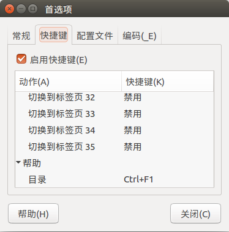
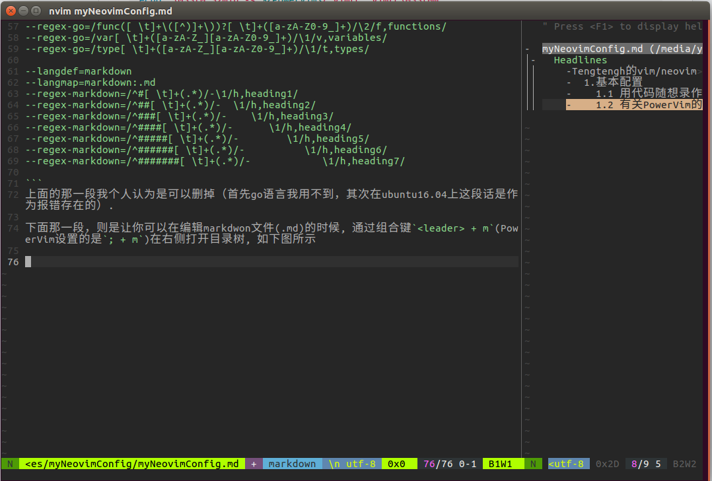
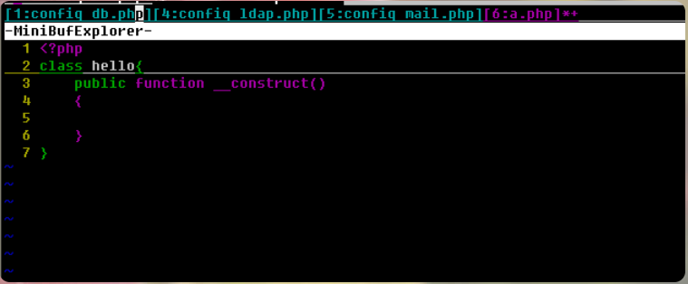

# Tengtengh的vim/neovim的个人配置


这里记录一下我是怎么配置我现在用的vim的


<!-- vim-markdown-toc Marked -->

* [1 关于vim/neovim的基本配置的说明](#1-关于vim/neovim的基本配置的说明)
    * [1.1 vim](#1.1-vim)
    * [1.2 neovim](#1.2-neovim)
* [2 我最开始使用的vim配置-PowerVim](#2-我最开始使用的vim配置-powervim)
    * [2.1 用代码随想录作者的 PowerVim](#2.1-用代码随想录作者的-powervim)
    * [2.2 PowerVim/.ctags](#2.2-powervim/.ctags)
    * [2.3 PowerVim--a.vim](#2.3-powervim--a.vim)
    * [2.4 PowerVim插件之minibufexpl.vim](#2.4-powervim插件之minibufexpl.vim)
    * [2.5 PowerVim插件之statusline.vim](#2.5-powervim插件之statusline.vim)
    * [2.6 PowerVim插件之taglist.vim](#2.6-powervim插件之taglist.vim)
    * [2.7 PowerVim插件之ack](#2.7-powervim插件之ack)
    * [2.8 PowerVim插件之autocomplpop](#2.8-powervim插件之autocomplpop)
    * [2.9 PowerVim插件之vim-commentary](#2.9-powervim插件之vim-commentary)
    * [2.10 PowerVim插件之NERDTree](#2.10-powervim插件之nerdtree)
    * [2.11 PowerVim插件之vim-gitgutter](#2.11-powervim插件之vim-gitgutter)
    * [2.12 PowerVim--vimrc/init.vim](#2.12-powervim--vimrc/init.vim)
* [3 我的改动说明](#3-我的改动说明)
    * [3.1 vimrc/init.vim改动说明](#3.1-vimrc/init.vim改动说明)
    * [3.2 vim-plug插件管理器](#3.2-vim-plug插件管理器)
    * [3.3 vim颜色主题的更改--onedark](#3.3-vim颜色主题的更改--onedark)
    * [3.4 括号自动补全插件auto-pair](#3.4-括号自动补全插件auto-pair)
    * [3.5 markdown相关插件](#3.5-markdown相关插件)
* [4. vim/neovim 的一些操作等学习记录](#4.-vim/neovim-的一些操作等学习记录)
    * [4.1 文件编码问题；](#4.1-文件编码问题；)
    * [4.2 在ubuntu16.04上通过源码安装VIM8.2](#4.2-在ubuntu16.04上通过源码安装vim8.2)

<!-- vim-markdown-toc -->


<!-- vim-markdown-toc GFM -->

* [1 关于vim/neovim的基本配置的说明](#1-关于vimneovim的基本配置的说明)
    * [1.1 vim](#11-vim)
    * [1.2 neovim](#12-neovim)
* [2 我最开始使用的vim配置-PowerVim](#2-我最开始使用的vim配置-powervim)
    * [2.1 用代码随想录作者的 PowerVim](#21-用代码随想录作者的-powervim)
    * [2.2 PowerVim/.ctags](#22-powervimctags)
    * [2.3 PowerVim--a.vim](#23-powervim--avim)
    * [2.4 PowerVim插件之minibufexpl.vim](#24-powervim插件之minibufexplvim)
    * [2.5 PowerVim插件之statusline.vim](#25-powervim插件之statuslinevim)
    * [2.6 PowerVim插件之taglist.vim](#26-powervim插件之taglistvim)
    * [2.7 PowerVim插件之ack](#27-powervim插件之ack)
    * [2.8 PowerVim插件之autocomplpop](#28-powervim插件之autocomplpop)
    * [2.9 PowerVim插件之vim-commentary](#29-powervim插件之vim-commentary)
    * [2.10 PowerVim插件之NERDTree](#210-powervim插件之nerdtree)
    * [2.11 PowerVim插件之vim-gitgutter](#211-powervim插件之vim-gitgutter)
    * [2.12 PowerVim--vimrc/init.vim](#212-powervim--vimrcinitvim)
* [3 我的改动说明](#3-我的改动说明)
    * [3.1 vimrc/init.vim改动说明](#31-vimrcinitvim改动说明)

<!-- vim-markdown-toc -->


## 1 关于vim/neovim的基本配置的说明

### 1.1 vim

对于vim来说，它的配置主要由vimrc和.vim文件夹(`~/.vimrc`)两部分组成，vimrc中书写vimrc的默认配置（类似于bashrc）, `.vim`文件夹中存放vim的各种插件

很多人是将vimrc文件放置在主目录下: `~/.vimrc`, 一个隐藏文件

但是我通常，是将它直接放置在`.vim/`下的: `~/.vim/vimrc`,(不是隐藏文件), 这种情况在`~/.vimrc`不存在的时候是被允许的。
具体可以在终端输入命令: `vim --version`进行查看，输出如下：


```bash
   系统 vimrc 文件: "$VIM/vimrc"
     用户的 vimrc 配置文件: "$HOME/.vimrc"
 第二用户 vimrc 文件: "~/.vim/vimrc"
      用户 exrc 文件: "$HOME/.exrc"
  系统 gvimrc 文件: "$VIM/gvimrc"
    用户 gvimrc 文件: "$HOME/.gvimrc"
第二用户 gvimrc 文件: "~/.vim/gvimrc"
    系统菜单文件: "$VIMRUNTIME/menu.vim"
  $VIM 预设值: "/usr/share/vim"
```


### 1.2 neovim

对于vim来说，主要是vimrc和.vim ，那么对于neovim来说，就是init.vim和nvim/.
它们在unix系统中的默认路径为`~/.config/nvim/init.vim`, `~/.config/nvim/`

可以通过在vim的NOMAL模式下执行`:help config`、`:help vim-differences`命令来查看，如下:

```bash
The config file is located at:         
      Unix                    ~/.config/nvim/init.vim         (or init.lua)  
      Windows                 ~/AppData/Local/nvim/init.vim   (or init.lua)   
      $XDG_CONFIG_HOME        $XDG_CONFIG_HOME/nvim/init.vim  (or init.lua)

### 1.3 如果你没有设置$XDG_CONFIG_HOME, 路径的话，默认就是.config,(应该是这样的)
```


>1. Configuration					    *nvim-config*
>
>- Use `$XDG_CONFIG_HOME/nvim/init.vim` instead of `.vimrc` for your |config|.
>- Use `$XDG_CONFIG_HOME/nvim` instead of `.vim` to store configuration files.
>- Use `$XDG_DATA_HOME/nvim/shada/main.shada` instead of `.viminfo` for persistent session information.  |shada|


其实neovim和vim基本上是共通的，据说是vim在现阶段已经达到了一个瓶颈，升级改进的难度较大，所以neovim的作者在vim的基础上开发了neovim，有一些细节和默认配置上的差异, 据说neovim比vim更加优秀，尤其是在Mac上，vim会比较卡，通常情况下用neovim会好很多
但是经过我的使用，目前还没有感受到这它们俩之间的差别


## 2 我最开始使用的vim配置-PowerVim

### 2.1 用代码随想录作者的 PowerVim
我的最开始使用的配置是代码随想录作者推荐的他自用的vim配置：[PowerVim](https://github.com/youngyangyang04/PowerVim), 我的vim配置是在它的vim配置的基础上进行更改的

在ubuntu16.04和ubuntu18.04上安装使用PowerVim时会遇到一些小小的问题(不知道在ubuntu20.04上会不会有这种问题),具体的解决方案可以参考[PowerVim-issue_1](https://github.com/youngyangyang04/PowerVim/issues/3)。

并且打开PowerVim/install.h可以看到：

```bash

echo "\033[0;32mln -s ${PowerVim}/.vim .vim\033[0m"
ln -s ${PowerVim}/.vim .vim
echo "\033[0;32mln -s ${PowerVim}/.ctags .ctags\033[0m"
ln -s ${PowerVim}/.ctags .ctags

```

它是创建的链接，我建议是直接改成cp，将其`PowerVim/.vim`拷贝到你的`~/.vim`, 将它的`PowerVim/.vimrc`拷贝到你的`~/.vim/vimrc`, `PowerVim/ctags` cp 到 `~/.ctags`.


在ubuntu的终端中，快捷键`F1`是打开帮助目录，这与PowerVim中`F1`编译c++冲突了。需要在 编辑-首选项-快捷键中修改，这里我是设置成了`Ctrl + F1`, 或者是在键入快捷键的时候键入`<-Backspack`，这样就可以将这个快捷键禁用，我后来是直接禁用了(说起来，最开始是不知道怎么禁用才无奈设置成`Ctrl + F1`的).  后来我发现在ubuntu18.04上，这个快捷键好像本来就是禁用的。 :sweat_smile:




这样，你就可以用代码随想录作者的 PowerVim 了, 后面是有关PowerVim的一些说明, 主要是记录以下他是怎么配置的，PowerVim并没有使用插件管理器，并且它用到的很多插件都是非常old school的了，有的甚至十几年都没有维护了。

### 2.2 PowerVim/.ctags

`PowerVim/.ctags`的作用，打开这个文件你会看到如下内容：

```
--langdef=go
--langmap=go:.go
--regex-go=/func([ \t]+\([^)]+\))?[ \t]+([a-zA-Z0-9_]+)/\2/f,functions/
--regex-go=/var[ \t]+([a-zA-Z_][a-zA-Z0-9_]+)/\1/v,variables/
--regex-go=/type[ \t]+([a-zA-Z_][a-zA-Z0-9_]+)/\1/t,types/

--langdef=markdown
--langmap=markdown:.md
--regex-markdown=/^#[ \t]+(.*)/-\1/h,heading1/
--regex-markdown=/^##[ \t]+(.*)/-  \1/h,heading2/
--regex-markdown=/^###[ \t]+(.*)/-    \1/h,heading3/
--regex-markdown=/^####[ \t]+(.*)/-      \1/h,heading4/
--regex-markdown=/^#####[ \t]+(.*)/-        \1/h,heading5/
--regex-markdown=/^######[ \t]+(.*)/-          \1/h,heading6/
--regex-markdown=/^#######[ \t]+(.*)/-            \1/h,heading7/

```
上面的那一段我个人认为是可以删掉（首先go语言我用不到，其次在ubuntu16.04上这段话是作为报错存在的）.
其实也不能说是报错，不删也可以，就是打标签的时候，会报一句"ctags: Warning: Language "go" already defined",应该也没什么太大影响。。


下面那一段，则是让你可以在编辑markdwon文件(.md)的时候, 通过组合键`<leader> + m`(PowerVim设置的是`; + m`)在右侧打开目录树, 如下图所示

<!--  -->


 </img></div>


这里有一点比较搞笑的是，PowerVim的作者把目录树的Headlines写成了Headlins，这个直接在vimrc或者init.vim文件中修改即可


<font size=5><b>特别说明</font></b>
我后面的一些配置记录是记录了我在PoweVim的基础上根据我自己的需求，进行了一些改动，或许有一天我会从零开始配置我自己的vim，但是至少现阶段我的vim配置都是在PowerVim的基础上改的，因为我个人觉得PowerVim的配置我用起来还是比较舒服的 :-D


### 2.3 PowerVim--a.vim

https://github.com/vim-scripts/a.vim

能够在.h和.cpp文件之间快速切换，在vim中的命令是`:A`, 这里作者在vimrc文件中映射到了`<leader>a`


插件的位置放置在`~/config/nvim/plugin/a.vim`

```bash
nmap <Leader>a :A<CR>
```
虽然也是很老的插件，但是还可以


### 2.4 PowerVim插件之minibufexpl.vim 


https://github.com/fholgado/minibufexpl.vim

这个插件是管理buffer的，是一个非常老的插件了，插件的位置放置在`~/.config/nvim/bundle/`。

在vimrc中的设置如下：

```vim
let g:miniBufExplMapWindowNavArrows=1

"允许光标在任何位置时用CTRL-TAB遍历buffer
let g:miniBufExplMapCTabSwitchBufs=1

```

具体效果如下图，最上方的那个就是它




### 2.5 PowerVim插件之statusline.vim 

statusline.vim https://github.com/youngyangyang04/PowerVim/blob/master/.vim/plugin/statusline.vimrc

这个其实就是下面的状态栏, 如下图


### 2.6 PowerVim插件之taglist.vim


https://github.com/vim-scripts/taglist.vim

可以在右侧展开函数列表


```vim
" 使用TlistToggle查看文件函数列表。设置快捷键：<F12>
" 这里好像使用命令 :TlistOpen"
nnoremap  <Leader>m  :TlistToggle <CR> 

"teng目前表示可以关掉
"禁止自动改变当前Vim窗口的大小
"let Tlist_Inc_Winwidth=0
"把方法列表放在屏幕的右侧
let Tlist_Use_Right_Window=1
"让当前不被编辑的文件的方法列表自动折叠起来
let Tlist_File_Fold_Auto_Close=1 


let g:tlist_markdown_settings = 'markdown;h:Headlines'

```

### 2.7 PowerVim插件之ack 

https://github.com/mileszs/ack.vim

强大的搜索插件，可以搜索项目内的关键字和文件名

它的位置放置在了`~/.config/nvim/bundle/ack/`

具体可以查看这篇博客[Vim插件之ack.vim](https://blog.csdn.net/Demorngel/article/details/71147697), 这个写的还挺细


提一嘴，ack搜索命令为 `:ACK! name 路径`

<span id="28autocomplpop"></span>
### 2.8 PowerVim插件之autocomplpop 

https://github.com/vim-scripts/AutoComplPop


自动补全插件, 路径是在`~/.config/nvim/bundle/autocomplpop/`

可以参考这篇博客[vim的php自动补全,vim自动代码提示插件AutoComplPop | 木凡博客](https://blog.csdn.net/weixin_39846898/article/details/115595691),虽然写的不咋地(小声bb)


在init.vim中设置如下，上半部分我注释掉的是作者针对vim设置的.vim路径，我改成了~/.config/nvim/ 路径，其实是可以直接一个 ln -s 映射过去、通用，但是我直接把vim卸载了，直接就按照neovim配置来了


```vim
" 添加自动补全字典
" au FileType php setlocal dict+=~/.vim/dictionary/php_keywords_list.txt 
" au FileType cpp setlocal dict+=~/.vim/dictionary/cpp_keywords_list.txt
" au FileType java setlocal dict+=~/.vim/dictionary/java_keywords_list.txt
" au FileType markdown setlocal dict+=~/.vim/dictionary/words.txt

" Tengh改成neovim的路径
au FileType php setlocal dict+=~/.config/nvim/dictionary/php_keywords_list.txt 
au FileType cpp setlocal dict+=~/.config/nvim/dictionary/cpp_keywords_list.txt
au FileType java setlocal dict+=~/.config/nvim/dictionary/java_keywords_list.txt
" au FileType markdown setlocal dict+=~/.vim/dictionary/words.txt

```


### 2.9 PowerVim插件之vim-commentary

commentary https://github.com/tpope/vim-commentary


通过gc命令注释代码


用法可以参考这篇博客 [vim-commentary插件用法](https://blog.csdn.net/qq_31433709/article/details/105445055)


### 2.10 PowerVim插件之NERDTree

nerdtree https://github.com/scrooloose/nerdtree

NERDTree是用来生成目录树的，


它主要有几个全局命令


以下为网页翻译版本，原版见[NERDtree.txt](https://github.com/preservim/nerdtree/blob/master/doc/NERDTree.txt), 或者可以通过`:h NERDTree` 来查看


```txt
:NERDTree [ <开始目录> | <书签> ]                            *:NERDTree*
    打开一个新的 NERDTree。树的根取决于参数
    给定的。有3种情况：如果没有给出参数，则当前目录
    将会被使用。如果给定目录，则将使用该目录。如果书签
    给定名称，将使用相应的目录。例如：>
        :NERDTree /home/marty/vim7/src
        :NERDTree foo（foo 是书签的名称）
<
:NERDTreeVCS [ <开始目录> | <书签> ]                      *:NERDTreeVCS*
    喜欢| :NERDTree | , 但向上搜索目录树以找到
    版本控制系统存储库，并将 NERDTree 植根在那里。它
    适用于 Git、Subversion、Mercurial、Bazaar 和 Darcs 存储库。一种
    几个例子：>
        :NERDTreeVCS /home/marty/nerdtree/doc (打开 /home/marty/nerdtree)
        :NERDTreeVCS（打开包含 CWD 的存储库的根目录）
<
:NERDTreeFromBookmark <书签>                          *:NERDTreeFromBookmark*
    打开一个新的 NERDTree，根目录初始化为
    <书签>。在 :NERDTree 上使用此命令的唯一原因是
    完成（用于书签而不是目录）。

:NERDTreeToggle [ <开始目录> | <书签> ]                *:NERDTreeToggle*
    如果此选项卡已存在 NERDTree，则将其重新打开并呈现
    再次。如果给出<start-directory>或<bookmark>，则 NERDTree 的根
    设置为该路径。如果此选项卡不存在 NERDTree，则此命令
    作用与|相同 :NERDTree | 命令。

:NERDTreeToggleVCS [ <开始目录> | <书签> ]          *:NERDTreeToggleVCS*
    喜欢| :NERDTree切换| , 但向上搜索目录树以找到
    版本控制系统存储库，并将 NERDTree 植根在那里。它
    适用于 Git、Subversion、Mercurial、Bazaar 和 Darcs 存储库。一种
    几个例子：>
        :NERDTreeToggleVCS /home/marty/nerdtree/doc (打开 /home/marty/nerdtree)
        :NERDTreeToggleVCS（打开包含 CWD 的存储库的根目录）
:NERDTreeFocus                                                   *:NERDTreeFocus*
    如果当前不可见，则打开（或重新打开）NERDTree；
    否则，光标将移动到已经打开的 NERDTree。

:NERDTreeMirror                                                 *:NERDTreeMirror*
    在当前选项卡中共享来自另一个选项卡的现有 NERDTree。
    对一棵树所做的更改会反映在两者中，因为它们实际上是
    相同的缓冲区。

    如果仅存在一个其他 NERDTree，则该树会自动镜像。
    如果存在多个，脚本将询问要镜像哪棵树。

:NERDTreeClose                                                   *:NERDTreeClose*
    关闭此选项卡中的 NERDTree。

:NERDTreeFind [ <路径> ]                                            *:NERDTreeFind*
    没有可选参数，找到并显示活动的文件
    NERDTree 窗口中的缓冲区。使用<path>参数，查找和
    显示指定路径。

    焦点将转移到 NERDTree 窗口，光标将为
    放置在确定路径的树节点上。如果 NERDTree 用于
    当前选项卡不存在，将初始化一个新选项卡。

:NERDTreeCWD                                                       *:NERDTreeCWD*
    将 NERDTree 根更改为当前工作目录。如果不
    此选项卡存在 NERDTree，打开一个新选项卡。

:NERDTreeRefreshRoot                                       *:NERDTreeRefreshRoot*
    刷新 NERDTree 根节点。

```


在PowerVim中通过组合键`<leader>n`，即可在窗口左侧打开目录树


在vimrc/init.vim中的配置如下

```vim
" 使用NERDTree插件查看工程文件。设置快捷键
" nnoremap <silent> <Leader>n  :NERDTreeToggle <CR> 
nnoremap <Leader>n  :NERDTreeToggle <CR> 

" 设置NERDTree子窗口位置
let NERDTreeWinPos="left"
" 设置忽略的文件
let NERDTreeIgnore=['\.vim$', '\~$', '\.o$', '\.d$', '\.a$', '\.out$', '\.tgz$']
```
其中，上面的<silent>是静默执行的意思，可以参考这篇博客 [VIM学习笔记 静默执行命令(silent)](https://zhuanlan.zhihu.com/p/291583629)


### 2.11 PowerVim插件之vim-gitgutter


vim-gitgutter https://github.com/airblade/vim-gitgutter


这个插件是标记git改动信息的, 类似与vscode左边的信git息


比如右边的加号，就是这个插件的所显示的变化

可以看这篇文章[Vim-gitgutter：快速查看本次 commit 新增了什麼 ](https://ithelp.ithome.com.tw/articles/10238748)


可以通过在vimrc/init.vim中添加 `set updatetime=100`,设置这个更新时间，默认是4s，设置成100就是100ms

ok


### 2.12 PowerVim--vimrc/init.vim


## 3 我的改动说明

### 3.1 vimrc/init.vim改动说明


默认tab缩进是两空格，这里我设置成了4


```vim
"teng add 2022-3-19
"syntax on	"设置语法高亮，一般默认有，可不用添加此句
set tabstop=4		"设置制表符宽度为4
set softtabstop=4 	"设置软制表符宽度为4
set shiftwidth=4		"设置缩进的空格数为4

```

这句我注释掉了，因为什么原因我忘记了


```vim
"set mouse=a "打开鼠标功能 tengadd
```


我把PowerVim作者的自动补全注释掉了，因为我觉得并不好用，我用了插件[auto-pair](https://github.com/jiangmiao/auto-pairs)去替代它，这个更加智能。


```vim

""  Tengh注释掉了，因为安装了auto-pair插件
""花括号自动格式化，首行一个tab
"autocmd FileType cpp,java inoremap { {<CR>}<ESC>kA<CR>

set fenc=" "
"显示匹配
set showmatch

"
""  Tengh注释掉了，因为安装了auto-pair插件
"括号匹配
"inoremap ( ()<ESC>i
"inoremap [ []<ESC>i
"inoremap ' ''<ESC>i
"inoremap " ""<ESC>i


```


要使用这个功能就要手动创建`~/tmp/clipboard.txt`,不过我是从来不用的，因为我有的更好的快捷键去代替它，也就是后面会提到的`<leader>y`


```vim
image 本身是没有这个文件和文件夹的，要手动创建它
" 使用ctrlc, v就可以实现vim之间的复制粘贴
vnoremap <C-c> :w! ~/tmp/clipboard.txt <CR> 
inoremap <C-v> <Esc>:r ~/tmp/clipboard.txt <CR>

```

这里我把`<leader>p`映射成了系统剪切板的粘贴，这样可以与外部进行复制粘贴(之前只有复制没有粘贴), 然后我把`<leader>p`原本映射的快捷键改成了`<leader>p1`.
```
" 粘贴到系统剪切板
" map <Leader>y "*y
map <Leader>y "+y
map <Leader>p "+p

" open/close Syntastic checker
nnoremap <Leader>p1 :SyntasticToggleMode<CR> :w<CR>
```

下面改的这个是自动补全的路径，这个改动我在[2.8 PowerVim--autocomplpop](#28autocomplpop) 中已经提到过了


在init.vim中设置如下，上半部分我注释掉的是作者针对vim设置的.vim路径，我改成了~/.config/nvim/ 路径，其实是可以直接一个 ln -s 映射过去、通用，但是我直接把vim卸载了，直接就按照neovim配置来了


```vim
" 添加自动补全字典
" au FileType php setlocal dict+=~/.vim/dictionary/php_keywords_list.txt 
" au FileType cpp setlocal dict+=~/.vim/dictionary/cpp_keywords_list.txt
" au FileType java setlocal dict+=~/.vim/dictionary/java_keywords_list.txt
" " au FileType markdown setlocal dict+=~/.vim/dictionary/words.txt

" Tengh改成neovim的路径
au FileType php setlocal dict+=~/.config/nvim/dictionary/php_keywords_list.txt 
au FileType cpp setlocal dict+=~/.config/nvim/dictionary/cpp_keywords_list.txt
au FileType java setlocal dict+=~/.config/nvim/dictionary/java_keywords_list.txt
" au FileType markdown setlocal dict+=~/.vim/dictionary/words.txt

```


```vim
"设置不同的模式光标的形状：
"NORMAL模式下显示小方块
"INSERT模式下显示竖线
"REPLACE模式(类似word的ins模式)下显示为下划线
"Mode Settings
let &t_SI.="\e[5 q" "SI = INSERT mode
let &t_SR.="\e[4 q" "SR = REPLACE mode
let &t_EI.="\e[1 q" "EI = NORMAL mode (ELSE)
```

### 3.2 vim-plug插件管理器

管理插件的，类似的还有Vundle等，网上都说Vundle比较老了，现在都用vim-plug，于是我就用了这个。

https://github.com/junegunn/vim-plug


安装vim-plug插件也是异常的简单，按照其github-README的教程就是

Installation
Download plug.vim and put it in the "autoload" directory.


使用的话，就是在vimrc/init.vim里面，如下：


```vim
call plug#begin('~/.config/nvim/plugged')

"安装插件(markdown图片粘贴)
Plug 'ferrine/md-img-paste.vim' 

" 生成markdown目录的插件
Plug 'mzlogin/vim-markdown-toc'

call plug#end()

```

把要安装的插件写在中中间，执行`:PlugInstall`

注意：刚写入进vimrc和init.vim的内容，直接执行是安装不了的，得重新打开vimrc/init.vim


### 3.3 vim颜色主题的更改--onedark


这里我用的是onedark，因为我之前Vscode用的是onedark pro，这个跟那个差不多，感觉很舒服。

https://github.com/joshdick/onedark.vim


按照其github-README的教程，将它的onedark.vim/color/onedark.vim 和onedark.vim/autoload/onedark.vim 分别放置到我的nvim/color/ 和 nvim/autoload 路径下。

然后在init.vim中做如下修改：

```vim
colorscheme  onedark
" colorscheme Monokai_Gavin
```

或者是直接使用插件管理器，

```
Plug 'joshdick/onedark.vim'
```


直接把它下载到`~/.config/nvim/plugged/onedark.vim/`, 

这样的话，在vimrc/init.vim里面设置`colorscheme onedark`, 要把这句放到上面那句的下面, 会提示找不到.

### 3.4 括号自动补全插件auto-pair

我把PowerVim作者的自动补全注释掉了，下载了这个，这个跟vscode的括号补全比较像，我用起来很舒服

 https://github.com/jiangmiao/auto-pairs   

安装方式也比较easy，就直接在vimrc/init.vim中写入

```vim
"括号匹配插件 auto-pair https://github.com/jiangmiao/auto-pairs
Plug 'jiangmiao/auto-pairs'
```


### 3.5 markdown相关插件

1. markdown预览插件markdown-preview.nvim

https://github.com/iamcco/markdown-preview.nvim

小伙伴们要注意了，这个插件只支持neovim和vim>=8.1

安装方式非常简单，就是在vimrc/init.vim中写入

```vim
Plug 'iamcco/markdown-preview.nvim', { 'do': { -> mkdp#util#install() }, 'for': ['markdown', 'vim-plug']}

" If you have nodejs and yarn
Plug 'iamcco/markdown-preview.nvim', { 'do': 'cd app && yarn install'  }

```

再执行

```vim
:source %
:PluginInstall
:call mkdp#util#install()
```
即可


2. 将剪切板中的图片插入markdown--md-img-paste.vim


https://github.com/ferrine/md-img-paste.vim

安装方式，就是在vimrc/init.vim中添加

```vim
"安装插件(markdown图片粘贴)
Plug 'ferrine/md-img-paste.vim'
```

:PlugInstall 安装


```vim
"从剪切板插入markdown 图片的插件,ferrine/md-img-paste.vim 
"命令为 :call midp#MarkdownClipboardImage()

"设置默认储存文件夹。这里表示储存在当前文档所在文件夹下的'pic'文件夹下，相当于 ./pic/
let g:mdip_imgdir = 'image' 
"设置默认图片名称。当图片名称没有给出时，使用默认图片名称
let g:mdip_imgname = 'image'

"设置#MarkdownClipboardImage, 设置快捷键
" autocmd FileType markdown nnoremap <silent> <C-p> :call mdip#MarkdownClipboardImage()<CR>F%i

```


3. 插入markdown目录

https://github.com/mzlogin/vim-markdown-toc

```
Plug 'mzlogin/vim-markdown-toc'
```

具体插入、删除、更新目录等指令，可以在其github-README中查看，很详细


## 4. vim/neovim 的一些操作等学习记录


### 4.1 文件编码问题；

在vim中，防止中文乱码，在vimrc/init.vim中，我设置了 `set fileencodings = xxx,xxx,xxx,...`, 这让我能够在打开一个新的文件进行查看时，能够选择对应的编码。

但是对于gb2312编码的文件，taglist并不能正确的显示目录。

比如我之前用vscode编写的编码格式为gb2312格式的markdown文件，通过`<leader>m` 查看目录的时候，就显示为乱码，但是uft-8格式的文件确实正常的。

所以我应该将文件以uft-8的编码格式保存

经过研究，可以在vim中通过命令 `:set fileencoding=uft-8`,来将文件设置为uft-8编码格式，然后将文件通过`:w!`命令保存，便可以实现文件编码的转换。

同样的，在vscode中也有这个功能，就是通过点击文件底部状态栏中的编码名称，然后选择通过编码保存(Save with Encoding), 选择utf-8编码即可


额外的说明：

在vim中，gb2312、gbk 格式的文件，打开之后所显示的编码格式为：euc-cn、cp936

euc-cn就是gb2312


### 4.2 在ubuntu16.04上通过源码安装VIM8.2

主要参考的博客[ubuntu中源码安装编译Vim](https://blog.csdn.net/s969966195/article/details/70670202?spm=1001.2014.3001.5506)

还参考了[54.[ubuntu]自己编译安装vim 8.0的方法](https://blog.csdn.net/a464057216/article/details/52821171?spm=1001.2101.3001.6650.8&utm_medium=distribute.pc_relevant.none-task-blog-2%7Edefault%7EBlogCommendFromBaidu%7Edefault-8-52821171-blog-70670202.pc_relevant_default&depth_1-utm_source=distribute.pc_relevant.none-task-blog-2%7Edefault%7EBlogCommendFromBaidu%7Edefault-8-52821171-blog-70670202.pc_relevant_default&utm_relevant_index=13)

网上有通过apt-get安装最新VIM的方法，方法如下：

```bash
sudo add-apt-repository ppa:jonathonf/vim
sudo apt update
sudo apt install vim
```

2022-05-13: 在ubuntu16.04上通过上面的方法安装的VIM版本为8.2，在使用`:!ls`等命令的时候，会多显示一串字符，其中还有乱码，我看着很难受。直到后来发现，经常在底部也会显示这段乱码，我不知道是不是这个ppa源的问题。

而老版本的的VIM又不能支持markdown-preview的插件，我很烦，于是决定通过源码编译安装VIM8.2

http://ftp.vim.org/pub/pub/vim/unix/

在上面的网址中下载VIM8.2的压缩包

解压 

```bash
tar -xjvf vim-8.2.tar.bz2  
```

解压至 ~/downloads/vim82/

四、编译安装


```bash
cd ~/downloads/vim80/
```

设置Vim源码的编译属性


```bash
./configure --with-features=huge --enable-rubyinterp --enable-pythoninterp --with-python-config-dir=/usr/lib/python2.7/config-i386-linux-gnu/ --enable-perlinterp --enable-gui=gtk2 --enable-cscope --enable-luainterp --enable-perlinterp --enable-multibyte --prefix=/usr
```

需要重新配置可 输入 `make distclean` #清理一下上一次编译生成的所有文件

其中参数说明如下：

–with-features=huge：支持最大特性
–enable-rubyinterp：启用Vim对ruby编写的插件的支持
–enable-pythoninterp：启用Vim对python编写的插件的支持
–enable-luainterp：启用Vim对lua编写的插件的支持
–enable-perlinterp：启用Vim对perl编写的插件的支持
–enable-multibyte：多字节支持 可以在Vim中输入中文
–enable-cscope：Vim对cscope支持
–enable-gui=gtk2：gtk2支持,也可以使用gnome，表示生成gvim
–with-python-config-dir=/usr/lib/python2.7/config-i386-linux-gnu/ 指定 python 路径
–prefix=/usr：编译安装路径

```
sudo make VIMRUNTIMEDIR=/usr/share/vim/vim82
sudo make install
```


重新安装好之后删除掉原来的`~/.viminfo`
(否则“重新打开文件回到上一次光标编辑位置”不生效)


