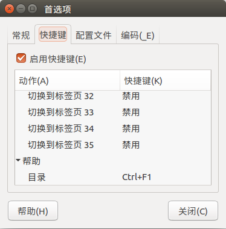
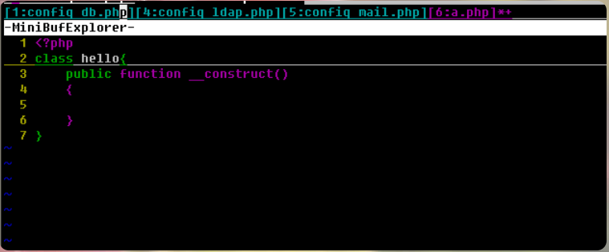

# Tengtengh的vim/neovim的个人配置

这里记录一下我是怎么配置我现在用的vim的

## 1 关于vim/neovim的基本配置的说明

### 1.1 vim

对于vim来说，它的配置主要由vimrc和.vim文件夹(`~/.vimrc`)两部分组成，vimrc中书写vimrc的默认配置（类似于bashrc）, `.vim`文件夹中存放vim的各种插件

很多人是将vimrc文件放置在主目录下: `~/.vimrc`, 一个隐藏文件

但是我通常，是将它直接放置在`.vim/`下的: `~/.vim/vimrc`,(不是隐藏文件), 这种情况在`~/.vimrc`不存在的时候是被允许的。
具体可以在终端输入命令: `vim --version`进行查看，输出如下：


```bash
   系统 vimrc 文件: "$VIM/vimrc"
     用户的 vimrc 配置文件: "$HOME/.vimrc"
 第二用户 vimrc 文件: "~/.vim/vimrc"
      用户 exrc 文件: "$HOME/.exrc"
  系统 gvimrc 文件: "$VIM/gvimrc"
    用户 gvimrc 文件: "$HOME/.gvimrc"
第二用户 gvimrc 文件: "~/.vim/gvimrc"
    系统菜单文件: "$VIMRUNTIME/menu.vim"
  $VIM 预设值: "/usr/share/vim"
```

### 1.2 neovim

对于vim来说，主要是vimrc和.vim ，那么对于neovim来说，就是init.vim和nvim/.
它们在unix系统中的默认路径为`~/.config/nvim/init.vim`, `~/.config/nvim/`

可以通过在vim的NOMAL模式下执行`:help config`、`:help vim-differences`命令来查看，如下:

```bash
The config file is located at:         
      Unix                    ~/.config/nvim/init.vim         (or init.lua)  
      Windows                 ~/AppData/Local/nvim/init.vim   (or init.lua)   
      $XDG_CONFIG_HOME        $XDG_CONFIG_HOME/nvim/init.vim  (or init.lua)

###如果你没有设置$XDG_CONFIG_HOME, 路径的话，默认就是.config,(应该是这样的)
```


>1. Configuration					    *nvim-config*
>
>- Use `$XDG_CONFIG_HOME/nvim/init.vim` instead of `.vimrc` for your |config|.
>- Use `$XDG_CONFIG_HOME/nvim` instead of `.vim` to store configuration files.
>- Use `$XDG_DATA_HOME/nvim/shada/main.shada` instead of `.viminfo` for persistent session information.  |shada|


其实neovim和vim基本上是共通的，据说是vim在现阶段已经达到了一个瓶颈，升级改进的难度较大，所以neovim的作者在vim的基础上开发了neovim，有一些细节和默认配置上的差异, 据说neovim比vim更加优秀，尤其是在Mac上，vim会比较卡，通常情况下用neovim会好很多
但是经过我的使用，目前还没有感受到这它们俩之间的差别


## 2 我最开始使用的vim配置-PowerVim

### 2.1 用代码随想录作者的 PowerVim
我的最开始使用的配置是代码随想录作者推荐的他自用的vim配置：[PowerVim](https://github.com/youngyangyang04/PowerVim), 我的vim配置是在它的vim配置的基础上进行更改的

在ubuntu16.04和ubuntu18.04上安装使用PowerVim时会遇到一些小小的问题(不知道在ubuntu20.04上会不会有这种问题),具体的解决方案可以参考[PowerVim-issue_1](https://github.com/youngyangyang04/PowerVim/issues/3)。

并且打开PowerVim/install.h可以看到：

```bash

echo "\033[0;32mln -s ${PowerVim}/.vim .vim\033[0m"
ln -s ${PowerVim}/.vim .vim
echo "\033[0;32mln -s ${PowerVim}/.ctags .ctags\033[0m"
ln -s ${PowerVim}/.ctags .ctags

```

它是创建的链接，我建议是直接改成cp，将其`PowerVim/.vim`拷贝到你的`~/.vim`, 将它的`PowerVim/.vimrc`拷贝到你的`~/.vim/vimrc`, `PowerVim/ctags` cp 到 `~/.ctags`.


在ubuntu的终端中，快捷键`F1`是打开帮助目录，这与PowerVim中`F1`编译c++冲突了。需要在 编辑-首选项-快捷键中修改，这里我是设置成了`Ctrl + F1`




这样，你就可以用代码随想录作者的 PowerVim 了。

### 2.2 PowerVim/.ctags

`PowerVim/.ctags`的作用，打开这个文件你会看到如下内容：

```
--langdef=go
--langmap=go:.go
--regex-go=/func([ \t]+\([^)]+\))?[ \t]+([a-zA-Z0-9_]+)/\2/f,functions/
--regex-go=/var[ \t]+([a-zA-Z_][a-zA-Z0-9_]+)/\1/v,variables/
--regex-go=/type[ \t]+([a-zA-Z_][a-zA-Z0-9_]+)/\1/t,types/

--langdef=markdown
--langmap=markdown:.md
--regex-markdown=/^#[ \t]+(.*)/-\1/h,heading1/
--regex-markdown=/^##[ \t]+(.*)/-  \1/h,heading2/
--regex-markdown=/^###[ \t]+(.*)/-    \1/h,heading3/
--regex-markdown=/^####[ \t]+(.*)/-      \1/h,heading4/
--regex-markdown=/^#####[ \t]+(.*)/-        \1/h,heading5/
--regex-markdown=/^######[ \t]+(.*)/-          \1/h,heading6/
--regex-markdown=/^#######[ \t]+(.*)/-            \1/h,heading7/

```
上面的那一段我个人认为是可以删掉（首先go语言我用不到，其次在ubuntu16.04上这段话是作为报错存在的）.

下面那一段，则是让你可以在编辑markdwon文件(.md)的时候, 通过组合键`<leader> + m`(PowerVim设置的是`; + m`)在右侧打开目录树, 如下图所示


这里有一点比较搞笑的是，PowerVim的作者把目录树的Headlines写成了Headlins，这个直接在vimrc或者init.vim文件中修改即可


<font size=5><b>特别说明</font></b>
我后面的一些配置记录是记录了我在PoweVim的基础上根据我自己的需求，进行了一些改动，或许有一天我会从零开始配置我自己的vim，但是至少现阶段我的vim配置都是在PowerVim的基础上改的，因为我个人觉得PowerVim的配置我用起来还是比较舒服的 :-D


### 2.2.3 PowerVim--a.vim

https://github.com/vim-scripts/a.vim

能够在.h和.cpp文件之间快速切换，在vim中的命令是`:A`, 这里作者在vimrc文件中映射到了`<leader>a`


插件的位置放置在`~/config/nvim/plugin/a.vim`

```bash
nmap <Leader>a :A<CR>
```
虽然也是很老的插件，但是还可以


### 2.2.4 PowerVim插件之minibufexpl.vim 


https://github.com/fholgado/minibufexpl.vim

这个插件是管理buffer的，是一个非常老的插件了，插件的位置放置在`~/.config/nvim/bundle/`。

在vimrc中的设置如下：

```vim
let g:miniBufExplMapWindowNavArrows=1

"允许光标在任何位置时用CTRL-TAB遍历buffer
let g:miniBufExplMapCTabSwitchBufs=1

```

具体效果如下图，最上方的那个就是它




### 2.2.5 PowerVim插件之statusline.vim 

statusline.vim https://github.com/youngyangyang04/PowerVim/blob/master/.vim/plugin/statusline.vimrc

这个其实就是下面的状态栏, 如下图


### 2.2.6 PowerVim插件之taglist.vim


https://github.com/vim-scripts/taglist.vim

可以在右侧展开函数列表


```vim
" 使用TlistToggle查看文件函数列表。设置快捷键：<F12>
" 这里好像使用命令 :TlistOpen"
nnoremap  <Leader>m  :TlistToggle <CR> 

"teng目前表示可以关掉
"禁止自动改变当前Vim窗口的大小
"let Tlist_Inc_Winwidth=0
"把方法列表放在屏幕的右侧
let Tlist_Use_Right_Window=1
"让当前不被编辑的文件的方法列表自动折叠起来
let Tlist_File_Fold_Auto_Close=1 


let g:tlist_markdown_settings = 'markdown;h:Headlines'

```

### 2.2.7 PowerVim插件之ack 

https://github.com/mileszs/ack.vim

强大的搜索插件，可以搜索项目内的关键字和文件名

它的位置放置在了`~/.config/nvim/bundle/ack/`

具体可以查看这篇博客[Vim插件之ack.vim](https://blog.csdn.net/Demorngel/article/details/71147697), 这个写的还挺细


提一嘴，ack搜索命令为 `:ACK! name 路径`


### 2.2.8 PowerVim插件之autocomplpop 

https://github.com/vim-scripts/AutoComplPop


自动补全插件, 路径是在`~/.config/nvim/bundle/autocomplpop/`

可以参考这篇博客[vim的php自动补全,vim自动代码提示插件AutoComplPop | 木凡博客](https://blog.csdn.net/weixin_39846898/article/details/115595691),虽然写的不咋地(小声bb)


在init.vim中设置如下，上半部分我注释掉的是作者针对vim设置的.vim路径，我改成了~/.config/nvim/ 路径，其实是可以直接一个 ln -s 映射过去、通用，但是我直接把vim卸载了，直接就按照neovim配置来了


```vim
" 添加自动补全字典
" au FileType php setlocal dict+=~/.vim/dictionary/php_keywords_list.txt 
" au FileType cpp setlocal dict+=~/.vim/dictionary/cpp_keywords_list.txt
" au FileType java setlocal dict+=~/.vim/dictionary/java_keywords_list.txt
" " au FileType markdown setlocal dict+=~/.vim/dictionary/words.txt

" Tengh改成neovim的路径
au FileType php setlocal dict+=~/.config/nvim/dictionary/php_keywords_list.txt 
au FileType cpp setlocal dict+=~/.config/nvim/dictionary/cpp_keywords_list.txt
au FileType java setlocal dict+=~/.config/nvim/dictionary/java_keywords_list.txt
" au FileType markdown setlocal dict+=~/.vim/dictionary/words.txt

```

### 2.2.9 PowerVim插件之vim-commentary

commentary https://github.com/tpope/vim-commentary


通过gc命令注释代码


用法可以参考这篇博客 [vim-commentary插件用法](https://blog.csdn.net/qq_31433709/article/details/105445055)


### 2.2.10 PowerVim插件之NERDTree

nerdtree https://github.com/scrooloose/nerdtree


NERDTree是用来生成目录树的，


在PowerVim中通过组合键`<leader>n`，即可在窗口左侧打开目录树


## 3 vimrc/init.vim改动说明

默认tab缩进是两空格，这里我设置成了4


```
"teng add 2022-3-19
"syntax on	"设置语法高亮，一般默认有，可不用添加此句
set tabstop=4		"设置制表符宽度为4
set softtabstop=4 	"设置软制表符宽度为4
set shiftwidth=4		"设置缩进的空格数为4

```


```

```


